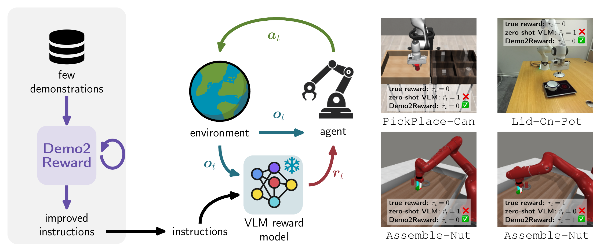

# Demo2Reward

Test-time adaptation of Vision-Language Model reward functions from a few expert demonstrations.

[](https://arxiv.org/abs/2606.00083)
[](https://openreview.net/forum?id=wjuZ5Qy141)
[](https://github.com/cgumbsch/Demo2Reward_RL)

## Idea



Reinforcement learning relies on accurate reward functions, which are often handcrafted or unavailable in real-world robotics. Recent work has explored using pre-trained Vision-Language Models (VLMs) as zero-shot reward models, but without careful prompt engineering these approaches produce suboptimal rewards, and false positive predictions can severely degrade downstream policy learning.

**Demo2Reward** is a test-time adaptation technique that optimizes the language instruction of a VLM reward model using a small set of expert demonstrations (3–10 trajectories). A Meta-Critic VLM iteratively rewrites the task instruction to reduce false positives while preserving true positives, requiring no additional model training or extra computation during policy learning.

This repository contains the prompt-optimization code (the Demo2Reward loop). It produces an optimized, binary success-detection instruction. **The repository for running RL experiments with VLM reward models can be found [here](https://github.com/cgumbsch/Demo2Reward_RL).**


## Installation

Tested with Python 3.10 and CUDA 12.1.

```bash
# Create and activate a virtual environment
python -m venv venv
source venv/bin/activate

# Install PyTorch (CUDA 12.1)
pip install torch==2.4.0 torchvision==0.19.0 --extra-index-url https://download.pytorch.org/whl/cu121

# Install flash-attn (requires CUDA toolkit and a GPU at build time)
pip install flash-attn==2.7.3 --no-build-isolation

# Install remaining dependencies
pip install -r requirements.txt
```

## Data layout

The demonstration datasets are not included. By default the code reads from
`--data_root` (default `./data`) using the following layout:

```
data/
  metaworld/<TaskName>/dataset.hdf5      # TaskName in {Assembly, BoxClose, CoffeePush, StickPull}
  robomimic/<task>/dataset.hdf5          # task in {can, square}
  real/<task>/dataset.pkl                # task in {lid}
```

The HDF5 dataset files can be generated from the [sibling RL repository](https://github.com/cgumbsch/Demo2Reward_RL).

## Usage

### Prompt optimization (`demo2reward.py`)

Refines a binary success/failure instruction.
A typical run with the default settings:

```bash
python demo2reward.py --task metaworld_assembly --data_root ./data
```

To use a separate, larger Meta-Critic model:

```bash
python demo2reward.py --task robomimic_can --meta_vlm qwen3_32b --data_root ./data
```

Available tasks are `metaworld_{assembly,boxclose,coffeepush,stickpull}`,
`robomimic_{can,square}`, and `real_lid` (add `--real_robot` for the real-robot
task). Optimized instructions, metrics, and result pickles are written under
`--output_dir` (default `./logs`) and can be inspected with TensorBoard.

Logging to W&B is optional. Enable it with
`--wandb` and provide your own project/entity:

```bash
python demo2reward.py --task metaworld_assembly --data_root ./data \
    --wandb --wandb_project my-project --wandb_entity my-team
```

### Plotting predictions (`plot_tikz.py`)

Visualize Critic predictions vs. ground-truth as TikZ/PNG plots:

```bash
# Zero-shot (no refined instruction)
python plot_tikz.py --task metaworld_boxclose --data_root ./data

# With a refined Demo2Reward instruction (insert the optimized instruction)
python plot_tikz.py --task metaworld_boxclose --data_root ./data \
    --instruction "In the final frame, determine if the robot ..."
```

## Citation


```bibtex
@misc{gumbsch2026demo2reward,
    title={From Demonstrations to Rewards: Test-Time Prompt Optimization for VLM Reward Models},
    author={Christian Gumbsch and Leonardo Barcellona and Lennard Schünemann and Platon Karageorgis and Andrii Zadaianchuk and Zehao Wang and Sergey Zakharov and Fabien Despinoy and Rahaf Aljundi and Efstratios Gavves},
    year={2026},
    eprint={2606.00083},
    archivePrefix={arXiv},
    primaryClass={cs.LG}
}
```
